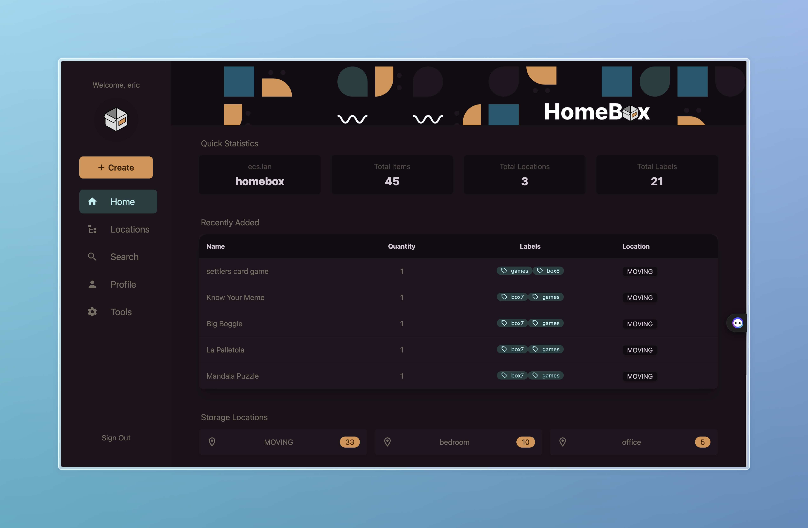
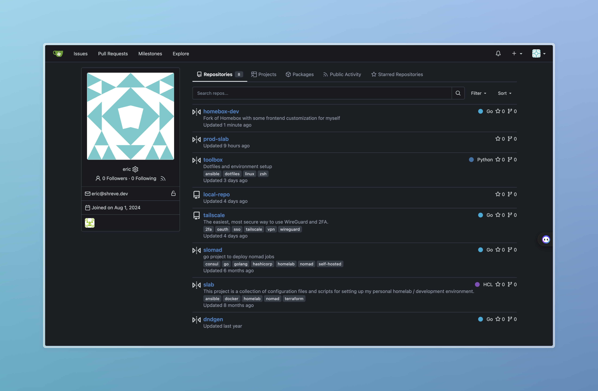
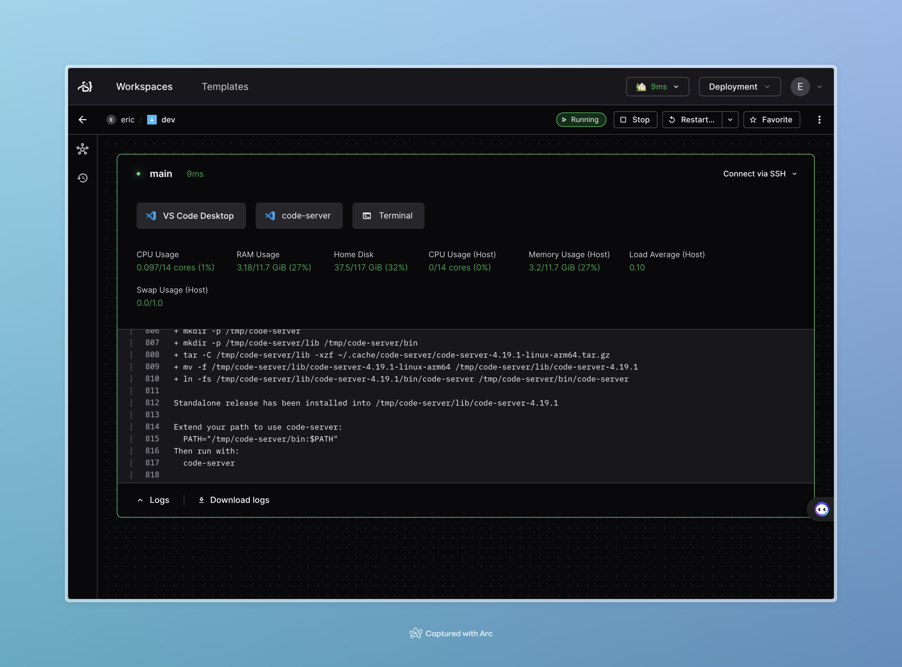

# prod-slab

Compose files for deploying applications in my homelab.

## Summary

Preparing my setup for an upcoming move, experimenting with configurations for [Homebox](#homebox), [Coder](#coder), and [Traefik](#traefik).

---

### _Apps_
- [Homepage](#homepage): Dashboard
- [Homebox](#homebox): Track the things
- [Gitea](#gitea): Git the things
- [Coder](#coder): Dev the things
  
### _Monitoring_
- [cAdvisor](#monitoring-and-metrics): Container metrics
- [NodeExporter](#monitoring-and-metrics): Host metrics
- [Grafana](#monitoring-and-metrics): Visualization
- [Prometheus](#monitoring-and-metrics): Metrics collection
- [Loki](#logging): Log collection

### _Infra_
- [Tailscale](#tailscale): Network connections
- [Traefik](#traefik): Request routing

## Apps

### Homepage

[Homepage](https://github.com/gethomepage/homepage) dashboards services and bookmarks with static YAML files and Docker labels.

### Homebox

[Homebox](https://github.com/sysadminsmedia/homebox) manages inventory. Using a forked image [`ecshreve/homebox-dev`](https://github.com/ecshreve/homebox-dev) with UI tweaks.

### Gitea

[Gitea](https://gitea.io/en-us/) backs up GitHub repos and experiments with git hooks. Uses a MySQL database accessible via Adminer.

### Coder

[Coder](https://coder.com/) manages dev environments with templates and workspaces. Currently running in a bespoke and slightly brittle local setup. The application isn't really designed for a single developer use case, but I've found it much more fun than VSCode devcontainers.

## Observability

### Monitoring and Metrics

[cAdvisor](https://github.com/google/cadvisor) and [Node Exporter](https://github.com/prometheus/node_exporter) collect metrics.

[Grafana](https://grafana.com/) visualizes via [Prometheus](https://prometheus.io/).

#### Dashboards

- [Node Exporter Full](https://grafana.com/grafana/dashboards/1860)

- [cAdvisor](https://grafana.com/grafana/dashboards/19792)

### Logging

Network logs sent to Synology log server.

Docker container logs are collected via [Loki]() and [Promtail](), and visualized in Grafana.

### Tracing

Traefik and Loki send traces to a Jaeger instance, traces are also visualized in Grafana.

## Network

### Traefik

[Traefik](https://doc.traefik.io/traefik/routing/providers/docker/) routes requests using `CONTAINER_NAME.ecs.lan`.

### DNS

Router uses wildcard DNS A record for `*.ecs.lan` pointing to the Traefik container's local network IP, which is advertised as a subnet route in tailscale.

### Tailscale

[Tailscale](https://tailscale.com/use-cases/homelab) secures connections between hosts and containers.

## Note

This setup is in progress and **not** suitable for internet exposure without additional configuration.

## TODO

- [ ] Terraform a DO droplet to use as a host or workspace target
- [ ] Add Kavita e-reader app
- [ ] Migrate secrets to HashiCorp Vault
- [ ] Add Jaeger for tracing
- [ ] Add backup Synology host to tailnet
- [ ] Backup volumes to vault2 (rename needed)
- [ ] Implement metric snapshot emails
- [ ] Backup strategy for GitHub -> Gitea
- [ ] Check on open Coder deployment issue on macOS
- [ ] Coder server via Docker on remote host, workspaces on laptop's Docker daemon
- [ ] Configure workspaces to connect to tailnet
- [ ] Bake dotfiles into Coder image
- [ ] Automation: auto commit-push if idle
- [ ] Move Coder templates into this repo
- [x] Include Pihole in repo
- [x] Set up secondary backup Pihole (deprecated primary)
- [x] Resolve CNAME issue (moved DNS handling to Synology)
- [x] Fix Tailscale-state volume issue on down/up
